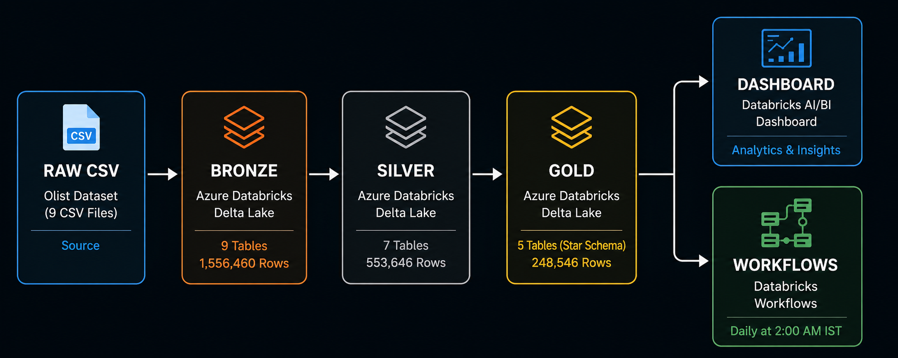
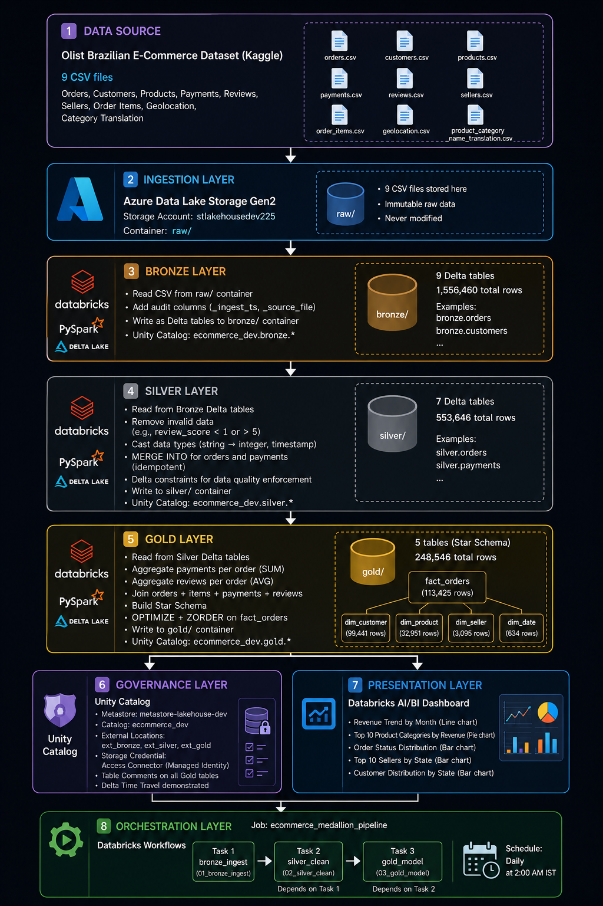

# 🏗️ Azure Databricks E-Commerce Lakehouse Pipeline

> End-to-end Medallion Architecture (Bronze/Silver/Gold) data pipeline built on Azure Databricks, processing **1.5M+ Brazilian e-commerce records** into governed, business-ready analytics tables with Unity Catalog governance.


---

## Architecture Overview



---

## Detailed Architecture



---

## Business Problem

An e-commerce company has raw transactional data landing in cloud storage as messy CSV files. Analysts cannot trust the data:

- Duplicates and nulls across order and payment records
- Inconsistent schemas and data types
- No single source of truth
- Every team building its own one-off extracts
- Conflicting numbers in reports

**This project solves all of that.**

---

## Solution

A governed Bronze/Silver/Gold Lakehouse on Delta Lake that delivers clean, deduplicated, business-ready Gold tables. Every team consumes one trusted source, data quality is enforced at each layer, and the pipeline runs automatically every night.

---

## Tech Stack

| Layer | Technology |
|---|---|
| Cloud Storage | Azure Data Lake Storage Gen2 |
| Compute | Azure Databricks |
| Processing | PySpark |
| Table Format | Delta Lake |
| Governance | Unity Catalog |
| Orchestration | Databricks Workflows |
| Dashboard | Databricks AI/BI Dashboard |
| Version Control | GitHub |

---

## Dataset

**Brazilian E-Commerce Public Dataset (Olist)**
- Source: [Kaggle](https://www.kaggle.com/datasets/olistbr/brazilian-ecommerce)
- 9 related CSV files
- ~1.5M rows across all tables
- Domain: Orders, Customers, Products, Payments, Reviews, Sellers

---

## Azure Infrastructure


---

## Data Volume

| Layer | Tables | Total Rows |
|---|---|---|
| Bronze | 9 | 1,556,460 |
| Silver | 7 | 553,646 |
| Gold | 5 | 248,546 |

---

## Bronze Layer

Raw ingestion layer. Reads CSV files from ADLS `raw/` container and writes as Delta tables with audit columns.

**Audit columns added:**
- `_ingest_ts` — timestamp of when data arrived
- `_source_file` — source file path for lineage


---

## Silver Layer

Data quality and cleaning layer.

**What Silver does:**
- Removes invalid data (review scores outside 1-5)
- Casts data types (string → integer, string → timestamp)
- MERGE INTO on orders and payments (idempotent upserts)
- Delta constraints enforce hard data quality rules

**Delta Constraints applied:**
```sql
order_id IS NOT NULL
payment_value >= 0
review_score BETWEEN 1 AND 5
price > 0
```


---

## Gold Layer — Star Schema

Business analytics layer. Joins 7 Silver tables into a dimensional model optimized for reporting.
fact_orders (113,425 rows)

├── dim_customer  (99,441 rows)

├── dim_product   (32,951 rows)

├── dim_seller    (3,095 rows)

└── dim_date      (634 rows)

**Aggregations applied:**
- Payments aggregated per order (`SUM payment_value`)
- Reviews aggregated per order (`AVG review_score`)

**Performance optimizations:**
- `OPTIMIZE` — compacted 4 files into 1
- `ZORDER BY (order_date, customer_id)` — speeds up date range and customer queries


---

## Unity Catalog Governance


**Governance setup:**
- Metastore: `metastore-lakehouse-dev` (Central India)
- Catalog: `ecommerce_dev`
- Schemas: `bronze`, `silver`, `gold`
- External Locations: `ext_bronze`, `ext_silver`, `ext_gold`
- Storage Credential: Access Connector (Managed Identity)
- Table comments on all Gold tables
- Delta Time Travel demonstrated

**Table Lineage:**


---

## Delta Time Travel


```python
# Query any previous version
spark.read.format("delta") \
    .option("versionAsOf", 0) \
    .table("ecommerce_dev.gold.fact_orders")
```

---

## Dashboard

Built on Databricks AI/BI Dashboard querying Gold tables directly via Unity Catalog.


**Charts:**
- Revenue Trend by Month (Line chart)
- Top 10 Product Categories by Revenue (Pie chart)
- Order Status Distribution — 97% delivered (Bar chart)
- Top 10 Sellers by State — SP dominant (Bar chart)
- Customer Distribution by State (Bar chart)

---

## Orchestration — Databricks Workflows

Automated pipeline running daily at 2:00 AM IST.


**Job:** `ecommerce_medallion_pipeline`

Task 1: bronze_ingest   → 01_bronze_ingest notebook

Task 2: silver_clean    → 02_silver_clean notebook (depends on Task 1)

Task 3: gold_model      → 03_gold_model notebook  (depends on Task 2)

---

## Key Challenges Solved

**1. Schema Drift**
Added `mergeSchema=true` to Bronze writes — handles new columns automatically without breaking the pipeline.

**2. Late-Arriving Payments**
Replaced `mode("overwrite")` with Delta `MERGE INTO` on orders and payments — idempotent upserts handle late arrivals without duplicates.

**3. Data Quality Enforcement**
Enforced at two levels — cleaning during ingestion and Delta constraints as hard rules that reject future bad data automatically.

**4. Joining 9 Normalized Tables**
Built a star schema Gold layer joining 4 Silver tables into `fact_orders` with aggregated payment totals and average review scores per order.

**5. Idempotent Re-runs**
Validated end-to-end by dropping all 21 tables, clearing all ADLS containers, and rerunning the full pipeline — all tables passed row count validation on every run.

---

## Project Structure

azure-databricks-ecommerce-lakehouse/

├── notebooks/

│   ├── 01_bronze_ingest.ipynb

│   ├── 02_silver_clean.ipynb

│   ├── 03_gold_model.ipynb

│   └── 04_unity_catalog_operations.ipynb

├── docs/

│   └── screenshots/

└── README.md


---

## How to Run

**Prerequisites:**
- Azure subscription
- Azure Databricks workspace (Premium tier recommended)
- ADLS Gen2 storage account
- Unity Catalog metastore configured

**Steps:**
1. Upload Olist CSVs to ADLS `raw/` container
2. Configure Unity Catalog metastore and external locations
3. Run `01_bronze_ingest` — ingests 9 CSVs into Bronze Delta tables
4. Run `02_silver_clean` — cleans and writes to Silver
5. Run `03_gold_model` — builds star schema in Gold
6. Run `04_unity_catalog_operations` — applies governance

Or run automatically via Databricks Workflow job `ecommerce_medallion_pipeline`.

---

## Resume Bullets

- Designed and built an end-to-end Lakehouse on Azure Databricks using Medallion Architecture (Bronze/Silver/Gold), processing 1.5M+ e-commerce records into governed, business-ready tables
- Implemented idempotent incremental loads with Delta MERGE INTO, schema enforcement, and OPTIMIZE/ZORDER, ensuring pipeline reliability through full end-to-end rerun validation
- Established Unity Catalog governance with 3-level namespace, external locations, managed identity authentication, table lineage, and table comments
- Enforced data quality at two levels — cleaning during ingestion and Delta constraints as hard rules rejecting future bad data automatically
- Orchestrated end-to-end pipeline using Databricks Workflows with dependency management across Bronze, Silver, and Gold layers, scheduled daily at 2 AM IST

---

## Author

**Alvin David**  
Data Engineer | Kochi, Kerala  
GitHub: [github.com/AlvinDavid225](https://github.com/AlvinDavid225)
