# 🏗️ Azure Databricks E-Commerce Lakehouse Pipeline

> End-to-end Medallion Architecture (Bronze/Silver/Gold) data pipeline built on Azure Databricks, processing **1.5M+ Brazilian e-commerce records** into governed, business-ready analytics tables with Unity Catalog governance.


---

## Architecture

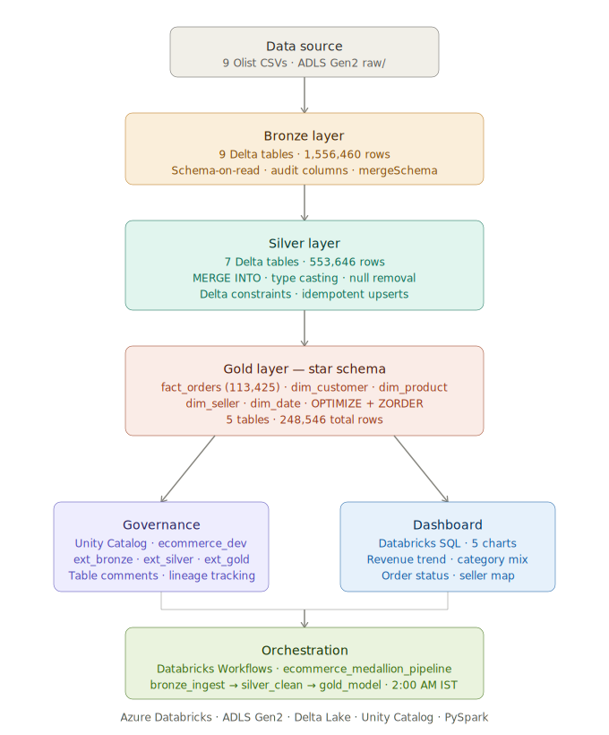

---

## Business Problem

An e-commerce company has raw transactional data landing in cloud storage as messy CSV files. Analysts cannot trust the data:

- Duplicates and nulls across order and payment records
- Inconsistent schemas and data types
- No single source of truth
- Every team building its own one-off extracts
- Conflicting numbers in reports

**This project solves all of that.**

---

## Solution

A governed Bronze/Silver/Gold Lakehouse on Delta Lake that delivers clean, deduplicated, business-ready Gold tables. Every team consumes one trusted source, data quality is enforced at each layer, and the pipeline runs automatically every night.

---

## Tech Stack

| Layer | Technology |
|---|---|
| Cloud Storage | Azure Data Lake Storage Gen2 |
| Compute | Azure Databricks |
| Processing | PySpark |
| Table Format | Delta Lake |
| Governance | Unity Catalog |
| Orchestration | Databricks Workflows |
| Dashboard | Databricks AI/BI Dashboard |
| Version Control | GitHub |

---

## Dataset

**Brazilian E-Commerce Public Dataset (Olist)**
- Source: [Kaggle](https://www.kaggle.com/datasets/olistbr/brazilian-ecommerce)
- 9 related CSV files
- ~1.5M rows across all tables
- Domain: Orders, Customers, Products, Payments, Reviews, Sellers

---

## Azure Infrastructure

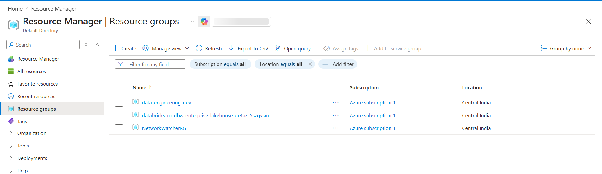

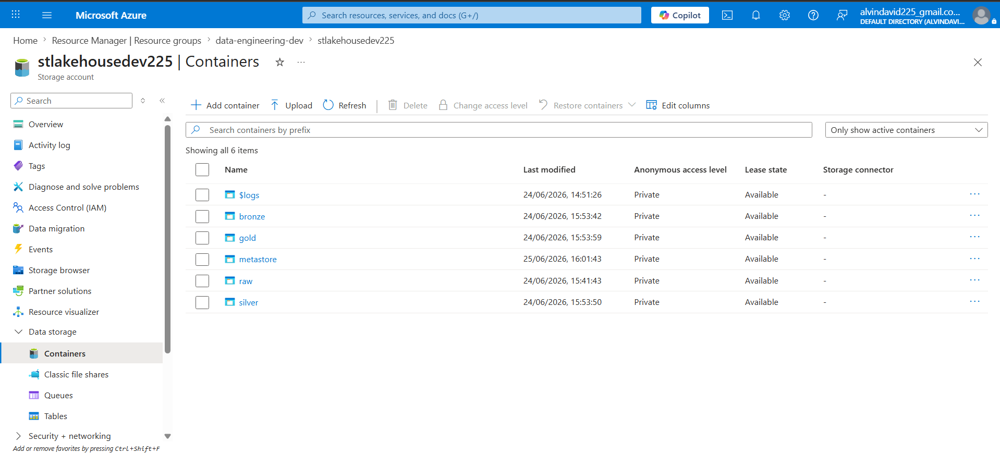

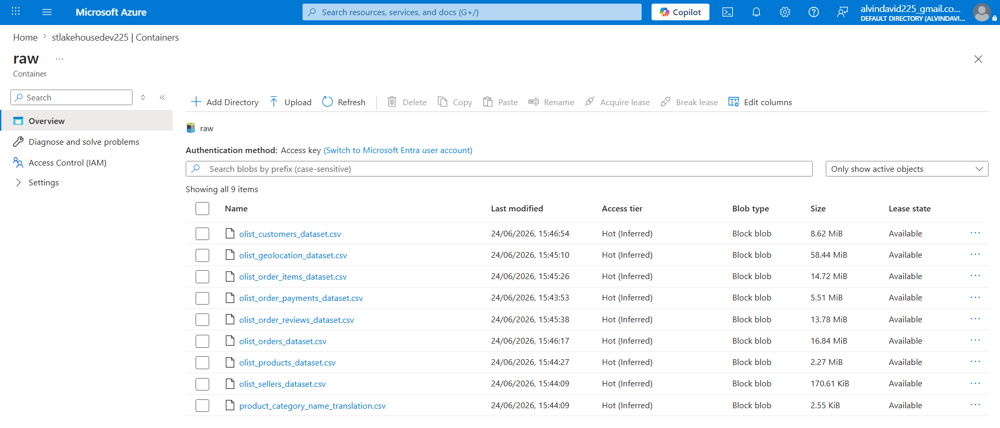

---

## Data Volume

| Layer | Tables | Total Rows |
|---|---|---|
| Bronze | 9 | 1,556,460 |
| Silver | 7 | 553,646 |
| Gold | 5 | 248,546 |

---

## Bronze Layer

Raw ingestion layer. Reads CSV files from ADLS `raw/` container and writes as Delta tables with audit columns.

**Audit columns added:**
- `_ingest_ts` — timestamp of when data arrived
- `_source_file` — source file path for lineage

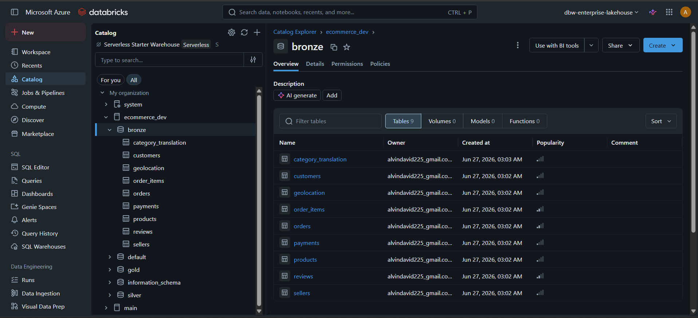

---

## Silver Layer

Data quality and cleaning layer.

**What Silver does:**
- Removes invalid data (review scores outside 1-5)
- Casts data types (string → integer, string → timestamp)
- MERGE INTO on orders and payments (idempotent upserts)
- Delta constraints enforce hard data quality rules

**Delta Constraints applied:**
```sql
order_id IS NOT NULL
payment_value >= 0
review_score BETWEEN 1 AND 5
price > 0
```

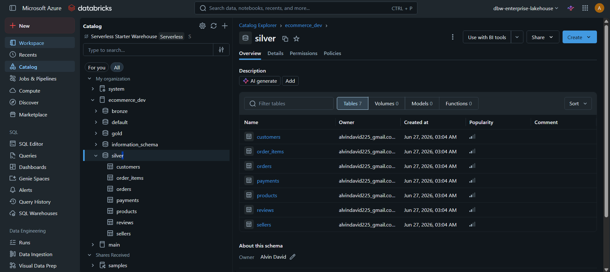

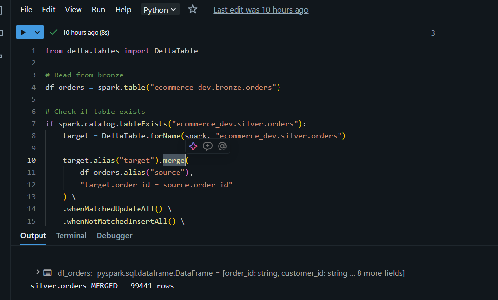

---

## Gold Layer — Star Schema

Business analytics layer. Joins 7 Silver tables into a dimensional model optimized for reporting.

```
fact_orders (113,425 rows)
├── dim_customer  (99,441 rows)
├── dim_product   (32,951 rows)
├── dim_seller     (3,095 rows)
└── dim_date         (634 rows)
```

**Aggregations applied:**
- Payments aggregated per order (`SUM payment_value`)
- Reviews aggregated per order (`AVG review_score`)

**Performance optimizations:**
- `OPTIMIZE` — compacted 4 files into 1
- `ZORDER BY (order_date, customer_id)` — speeds up date range and customer queries

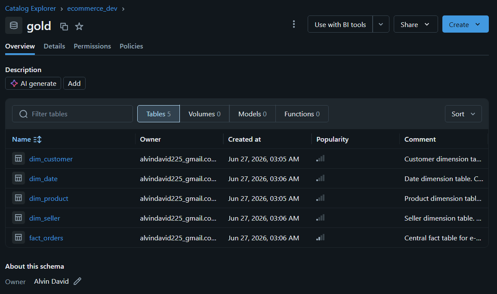

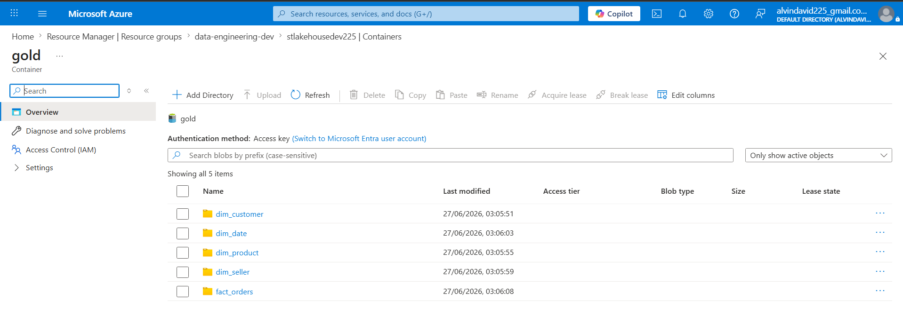

---

## Unity Catalog Governance

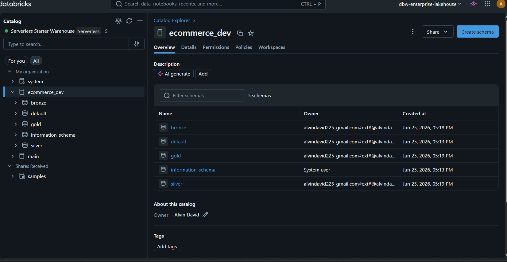

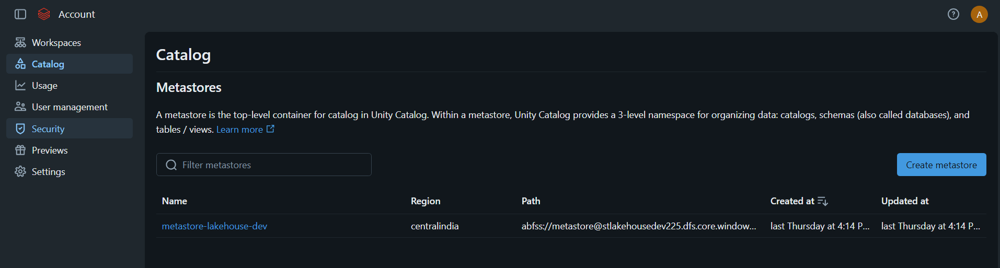

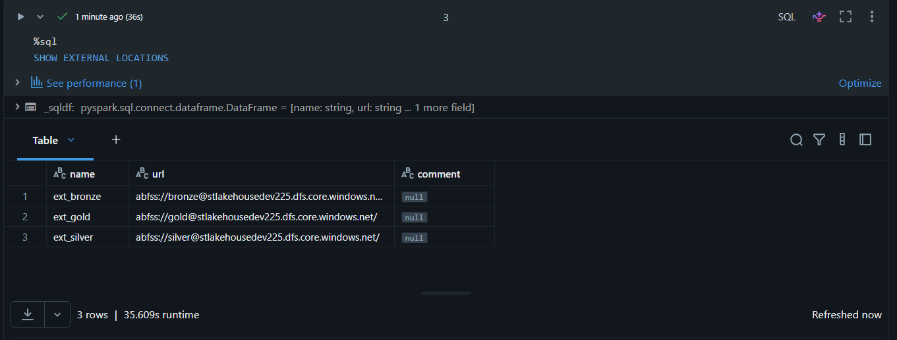

**Governance setup:**
- Metastore: `metastore-lakehouse-dev` (Central India)
- Catalog: `ecommerce_dev`
- Schemas: `bronze`, `silver`, `gold`
- External Locations: `ext_bronze`, `ext_silver`, `ext_gold`
- Storage Credential: Access Connector (Managed Identity)
- Table comments on all Gold tables
- Delta Time Travel demonstrated

**Table Lineage:**

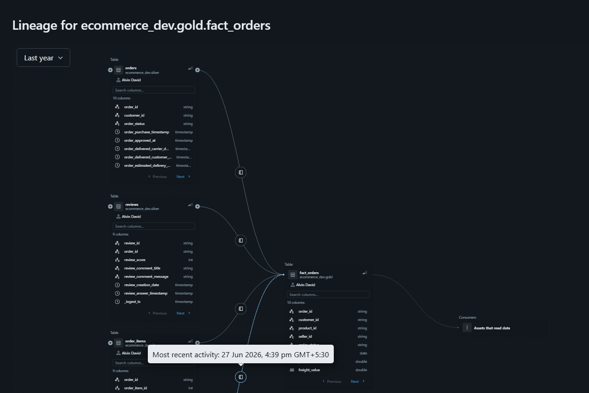

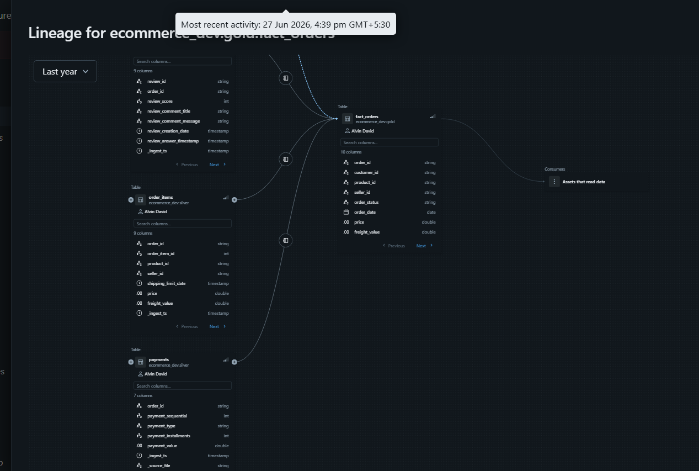

---

## Delta Time Travel

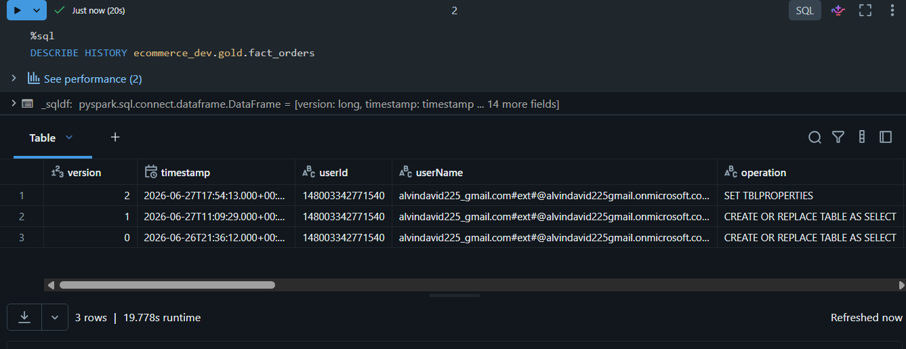

```python
# Query any previous version
spark.read.format("delta") \
    .option("versionAsOf", 0) \
    .table("ecommerce_dev.gold.fact_orders")
```

---

## Dashboard

Built on Databricks AI/BI Dashboard querying Gold tables directly via Unity Catalog.

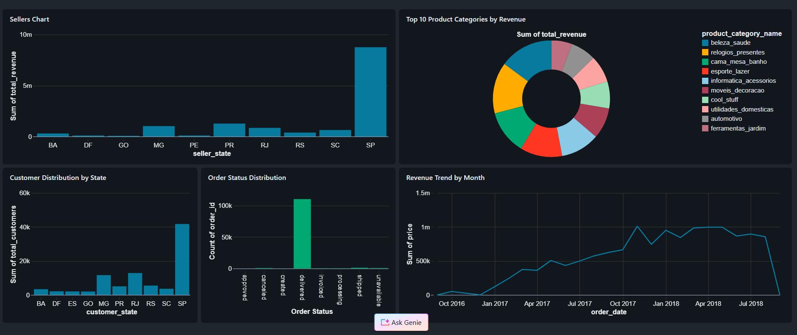

**Charts:**
- Revenue Trend by Month (Line chart)
- Top 10 Product Categories by Revenue (Pie chart)
- Order Status Distribution — 97% delivered (Bar chart)
- Top 10 Sellers by State — SP dominant (Bar chart)
- Customer Distribution by State (Bar chart)

SQL queries for all 5 charts available in [`sql/`](sql/).

---

## Orchestration — Databricks Workflows

Automated pipeline running daily at 2:00 AM IST.

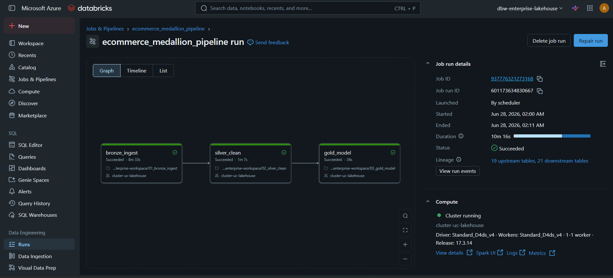

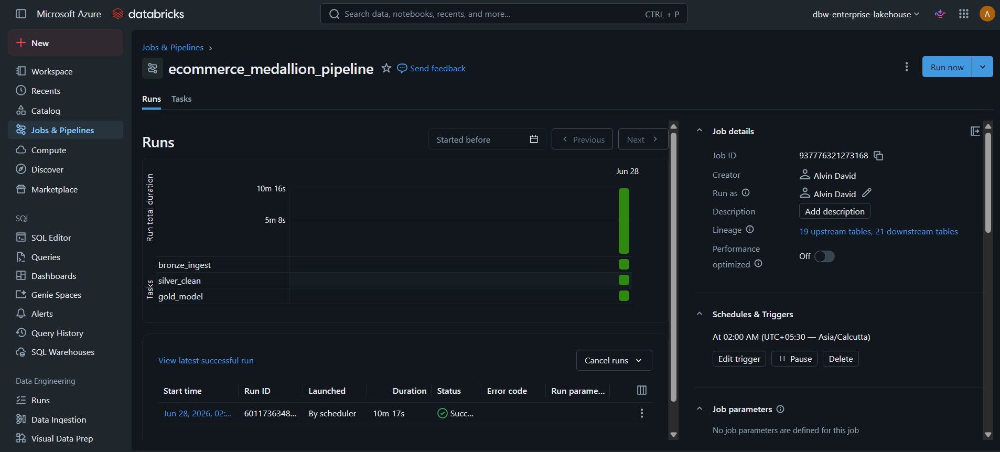

**Job:** `ecommerce_medallion_pipeline`

| Task | Notebook | Duration |
|---|---|---|
| bronze_ingest | 01_bronze_ingest | 8m 33s |
| silver_clean | 02_silver_clean | 1m 7s |
| gold_model | 03_gold_model | 34s |

**Total runtime: 10m 16s · Launched by scheduler · Status: Succeeded**

Workflow definition available in [`workflows/ecommerce_medallion_pipeline.yml`](workflows/ecommerce_medallion_pipeline.yml).

---

## Engineering Features

| Feature | Implemented |
|---|---|
| Medallion Architecture (Bronze/Silver/Gold) | ✅ |
| Delta Lake table format | ✅ |
| Unity Catalog governance | ✅ |
| Star schema modelling | ✅ |
| Databricks Workflows orchestration | ✅ |
| Delta Time Travel | ✅ |
| MERGE INTO (idempotent upserts) | ✅ |
| Delta constraints (data quality enforcement) | ✅ |
| Idempotent pipeline design | ✅ |
| OPTIMIZE + ZORDER (performance tuning) | ✅ |
| Audit columns (_ingest_ts, _source_file) | ✅ |
| Schema drift handling (mergeSchema) | ✅ |
| External tables (ADLS-backed) | ✅ |
| Managed Identity authentication | ✅ |
| Table comments and lineage tracking | ✅ |

---

## Performance Optimization

| Optimization | Applied To | Result |
|---|---|---|
| `OPTIMIZE` | fact_orders | Compacted 4 files → 1 file |
| `ZORDER BY (order_date, customer_id)` | fact_orders | Faster date range and customer join queries |
| External Delta tables | All layers | Storage persists independently of workspace |
| Serverless SQL Warehouse | Dashboard | Instant query startup, no cluster warm-up |

---

## Challenges and Solutions

| Challenge | Solution |
|---|---|
| Duplicate records on re-runs | MERGE INTO — idempotent upserts, no duplicates |
| Late-arriving payments | Composite key MERGE (order_id + payment_sequential) |
| Invalid review scores | filter(isin) + Delta constraint on review_score |
| Schema drift from upstream CSVs | mergeSchema=True on Bronze writes |
| Query performance on 113K fact rows | OPTIMIZE + ZORDER on order_date and customer_id |
| Storage–compute coupling | External Delta tables backed by ADLS Gen2 |
| Governance across 3 layers | Unity Catalog with external locations and managed identity |

---

## Project Metrics

| Metric | Value |
|---|---|
| Source CSV files | 9 |
| Bronze tables | 9 |
| Silver tables | 7 |
| Gold tables | 5 |
| Total records processed | 1.5M+ |
| fact_orders rows | 113,425 |
| Dashboard charts | 5 |
| Workflow tasks | 3 |
| Pipeline runtime | ~10 minutes |
| Data quality constraints | 4 |
| Unity Catalog external locations | 3 |

---

## Key Learnings

1. **MERGE INTO vs overwrite** — overwrite deletes everything and rewrites; MERGE is idempotent and safe for incremental production loads
2. **Two-level data quality** — cleaning at ingestion time catches known issues; Delta constraints catch any future bad data automatically
3. **External tables matter** — dropping a table should never delete your data; external tables decouple storage from compute
4. **Composite keys for multi-row entities** — a single order can have multiple payment rows; matching on `order_id` alone causes incorrect merges
5. **Unity Catalog lineage is automatic** — no manual documentation needed; the engine tracks Silver → Gold flows without any extra code
6. **Schema drift is inevitable** — building mergeSchema in from the start prevents pipeline failures when upstream adds columns

---

## Project Structure

```
azure-databricks-ecommerce-lakehouse/
├── architecture/
│   └── architecture.svg
├── dashboard/
│   └── dashboard.png
├── docs/
│   └── screenshots/
├── notebooks/
│   ├── 01_bronze_ingest.ipynb
│   ├── 02_silver_clean.ipynb
│   ├── 03_gold_model.ipynb
│   └── 04_unity_catalog_operations.ipynb
├── sql/
│   ├── 01_revenue_trend_by_month.sql
│   ├── 02_top_product_categories_by_revenue.sql
│   ├── 03_order_status_distribution.sql
│   ├── 04_seller_revenue_by_state.sql
│   └── 05_customer_distribution_by_state.sql
├── workflows/
│   └── ecommerce_medallion_pipeline.yml
├── LICENSE
└── README.md
```

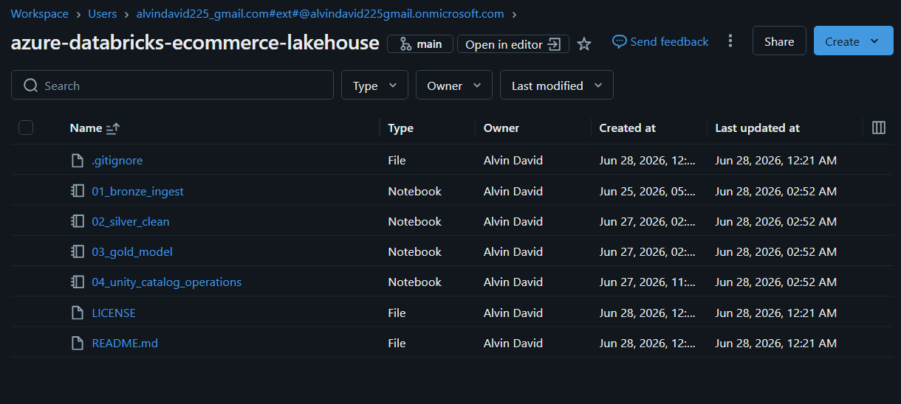

---

## How to Run

**Prerequisites:**
- Azure subscription
- Azure Databricks workspace (Premium tier recommended)
- ADLS Gen2 storage account
- Unity Catalog metastore configured

**Steps:**
1. Upload Olist CSVs to ADLS `raw/` container
2. Configure Unity Catalog metastore and external locations
3. Run `01_bronze_ingest` — ingests 9 CSVs into Bronze Delta tables
4. Run `02_silver_clean` — cleans and writes to Silver
5. Run `03_gold_model` — builds star schema in Gold
6. Run `04_unity_catalog_operations` — applies governance

Or run automatically via Databricks Workflow job `ecommerce_medallion_pipeline`.

---

## Author

**Alvin David**  
Data Engineer | Kochi, Kerala  
GitHub: [github.com/AlvinDavid225](https://github.com/AlvinDavid225)
